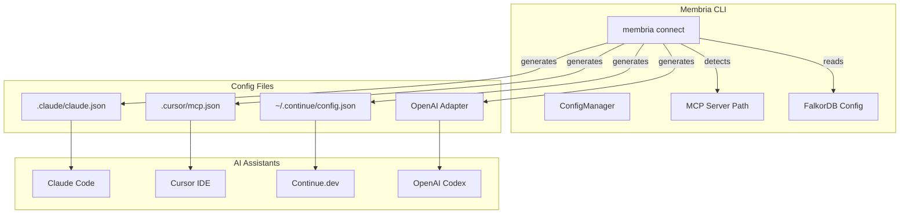

# Architecture Plan: `membria connect` CLI Command

## Problem Statement

Currently, connecting AI assistants to Membria requires manual configuration:
- Create `.claude/claude.json` for Claude
- Create `.cursor/mcp.json` for Cursor
- Edit `~/.continue/config.json` for Continue.dev
- Each config needs hardcoded paths and environment variables

**User's insight:** Membria should have its own CLI to configure AI assistants directly, rather than relying on VSCode extension or manual config files.

## Proposed Solution

Add a new `membria connect` command that configures AI assistants to use Membria MCP server.

```bash
membria connect <assistant> [options]
```

## Supported Assistants

| Assistant | Config File | Command |
|-----------|-------------|---------|
| Claude Code | `.claude/claude.json` | `membria connect claude` |
| Cursor IDE | `.cursor/mcp.json` | `membria connect cursor` |
| Continue.dev | `~/.continue/config.json` | `membria connect continue` |
| Codex/OpenAI | Custom integration | `membria connect codex` |

## Architecture Diagram



## Command Design

### `membria connect claude`

Creates `.claude/claude.json` in current directory:

```json
{
  "mcp_servers": {
    "membria": {
      "command": "python3",
      "args": ["/absolute/path/to/membria-cli/start_mcp_server.py"],
      "env": {
        "FALKORDB_HOST": "192.168.0.105",
        "FALKORDB_PORT": "6379"
      }
    }
  }
}
```

### `membria connect cursor`

Creates `.cursor/mcp.json` in current directory:

```json
{
  "mcp_servers": {
    "membria": {
      "command": "python3",
      "args": ["/absolute/path/to/membria-cli/start_mcp_server.py"],
      "env": {
        "FALKORDB_HOST": "192.168.0.105",
        "FALKORDB_PORT": "6379"
      }
    }
  }
}
```

### `membria connect continue`

Updates `~/.continue/config.json`:

```json
{
  "models": [...],
  "tools": [
    {
      "name": "membria",
      "type": "mcp",
      "command": "python3",
      "args": ["/absolute/path/to/membria-cli/start_mcp_server.py"],
      "env": {
        "FALKORDB_HOST": "192.168.0.105",
        "FALKORDB_PORT": "6379"
      }
    }
  ]
}
```

### `membria connect codex`

Creates OpenAI adapter configuration:

```bash
# Outputs instructions for using OpenAI function calling
# with membria tools via openai_adapter.py
```

## Implementation Plan

### Phase 1: Core Command Structure

1. Create `src/membria/commands/connect.py`
2. Add `connect_app` to CLI in `cli.py`
3. Implement `detect_mcp_server_path()` - auto-detect path to `start_mcp_server.py`
4. Implement `get_falkordb_config()` - read from ConfigManager

### Phase 2: Assistant Implementations

5. Implement `connect_claude()` - generate `.claude/claude.json`
6. Implement `connect_cursor()` - generate `.cursor/mcp.json`
7. Implement `connect_continue()` - update `~/.continue/config.json`
8. Implement `connect_codex()` - output OpenAI adapter instructions

### Phase 3: User Experience

9. Add `--dry-run` flag to preview config without writing
10. Add `--force` flag to overwrite existing config
11. Add `--project` flag to specify project directory
12. Add `membria connect all` to configure all assistants at once

## File Structure

```
membria-cli/
├── src/membria/
│   ├── commands/
│   │   ├── connect.py          # NEW: connect command
│   │   └── ...
│   ├── config.py               # ConfigManager with FalkorDB settings
│   └── cli.py                  # Register connect_app
└── start_mcp_server.py         # MCP server entry point
```

## Key Functions

```python
# src/membria/commands/connect.py

def detect_mcp_server_path() -> str:
    """Auto-detect absolute path to start_mcp_server.py"""
    
def get_mcp_config() -> dict:
    """Get MCP server configuration with FalkorDB settings"""
    
def connect_claude(project_dir: Path, dry_run: bool = False) -> None:
    """Generate .claude/claude.json"""
    
def connect_cursor(project_dir: Path, dry_run: bool = False) -> None:
    """Generate .cursor/mcp.json"""
    
def connect_continue(dry_run: bool = False) -> None:
    """Update ~/.continue/config.json"""
    
def connect_codex() -> None:
    """Output OpenAI adapter instructions"""
```

## User Workflow

```bash
# 1. Initialize Membria
membria init

# 2. Configure FalkorDB connection
membria config graph-remote 192.168.0.105 --port 6379

# 3. Connect AI assistants
membria connect claude    # Creates .claude/claude.json
membria connect cursor    # Creates .cursor/mcp.json
membria connect continue  # Updates ~/.continue/config.json

# Or connect all at once
membria connect all

# 4. Verify connection
membria doctor
# Should show:
# ✓ CLI installed
# ✓ Graph: connected to 192.168.0.105:6379
# ✓ MCP: configured for claude, cursor, continue
```

## Benefits

1. **Single source of truth** - Membria CLI manages all AI assistant configs
2. **No hardcoded paths** - Auto-detects MCP server path
3. **Consistent config** - Same FalkorDB settings across all assistants
4. **Easy onboarding** - One command to configure everything
5. **Version control friendly** - Config files in project directory

## Questions for User

1. Should `membria connect` also verify the MCP server starts correctly?
2. Should we support project-level vs global configuration?
3. Should we add `membria disconnect` to remove configs?
4. Any other AI assistants to support?

---

**Status:** Draft - Awaiting user approval
